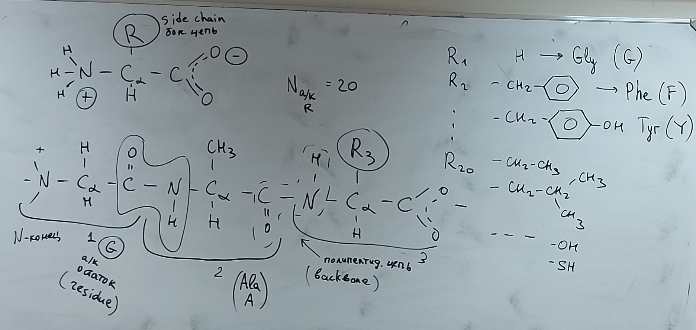

# Лекция 1 (06.09.2023)

## Вступление

Белок это полимерная молекула. (Это линейный полимер, который состоит из аминокислотных остатков)

Аминокислотный остаток это усеченная аминокислота.

## Мембранные белки

Клеточная мембрана состоит из молекул липидов (слой из 2ух молекул - би-слой)
В липиде есть - Полярная (гидрофильная - хорошо взаимодействует с водой) часть и ацильная цепь (жирный хвост - гидрофобная группа) (например, $CH_2-CH_2-CH_2-CH_3$ или $-CH=CH-CH_2...$) .

Мицелла - когда система липидов выстраиваются в круг полярной частью к воде.

Амфифильный - значит что в молекуле есть разделение на полярную и неполярную части.

Также в клеточную мембрану, могут быть встроены белки пронизывающие би-слой.
Интегральные мембранные белки (пронизывают би-слой насквозь)
Периферический мембранный белок (он не пронизывает би-слой насквозь, а только садится на него)
Белки-трансформеры (существуют и в воде, и могут взаимодействовать с мембранной, и могут через нее проникать)

Также в би-слое есть каналы для обмена (это тоже мембранные белки)

В воде белки прячут гидрофобную часть внутрь. Белки-трансформеры могут вывернутся гидрофобной частью наружу для прохода сквозь мембрану.

## Аминокислоты

### Структурная форма аминокислоты

### Аминокислота и структурная форма белка (из трех остатков аминокислот - трипиптид)

R1 R2 R3 (радикалы) - это Аминокислотная последовательность белка - Первичная структура белка.

Все радикалов? 20.

### Уровни структ. орг. белка:

- Первичная структура (Аминокислотная последовательность)
- 

