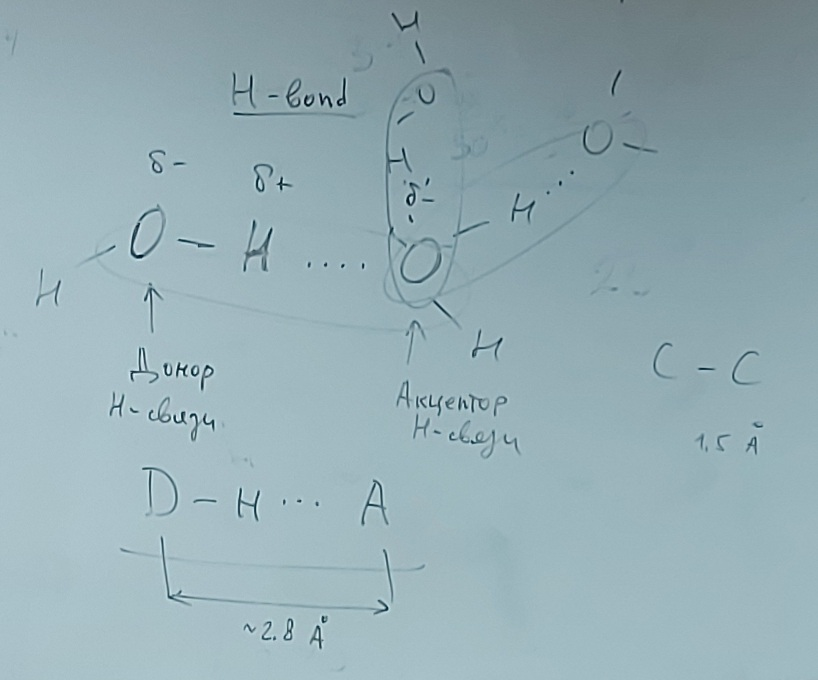

# Лекция 2 (14.09.2023)

Аминокислоты соединены пептидными связями

Пептидные связи бывают в **транс**конфигурации и **цис**конфигурации

## Виды связей

* Ковалентная
* Ионная
* Водородная

$D-H \cdot \cdot \cdot A$ - формула водородной связи (донор $-$ водород $\cdot \cdot \cdot$ акцептор)

Основные доноры и акцепторы: O (кислород), N (азот), S (сера), | ? C (углерод, при определенных условиях weak H-bond)

Для появления водородной связи должны выполнятся следующие условия:

1) Расстояние между D и A $<\approx2.8$ [Ангстрем] (1 Ангстрем = $10^{-10}$ метра)

2) Угол $\ang OHO =180 \pm 30$

### Водородные связи в пептидах

$N-H$
$C=O$

Водородные связи могут образовываться:

* внутри одного белка
* между разными белками
* с другими молекулами (с водой и т.д.)

Молекулы будут стараться образовать водородные связи, чтобы стремится к состоянию с минимальной свободной энергией

H-связей в n/пепт. цепи:

- $\alpha-$спираль
- $\beta-$структура
- $\beta-$поворот (изгиб)
- coil (rest)

### Альфа спираль

### Бета структура

### Бета поворот

### Уровни структ. орг. белка:

1. Первичная структура (Аминокислотная последовательность)
2. Вторичная структура (когда знаем какие аминокислотные остатки что составляют (альфа спирали, бета структуры и т.д.))
3. Третичная (пространственная / 3D) структура (когда знаем координаты всех атомов)
4. Четверичная структура

## Молекулярное моделирование в биологии (белки)

1. Структ. биоинформатика
2. Методы моделирования на основании гомологии (белки)
3. Молекулярный докинг
4. Методы основанные на расчетах энергии  (Force-filed methods)

Белок мишень X
Для него есть аминокислотная последовательность

$\downarrow$

$3D_x$

$\downarrow$

Динамика X (в 3D)

$\downarrow$

Межмолек. воздействие X в клетке

$\downarrow$

Мол. механизм работы X

$\downarrow$					$\downarrow$

в норме			при патологии

...
