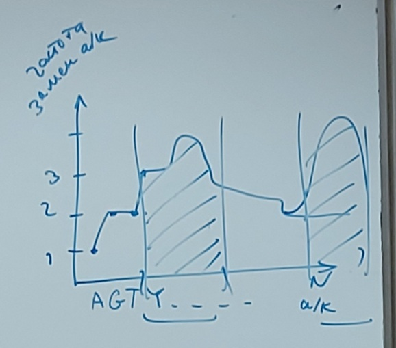

# Лекция 4 (27.09.2023)

Четыре метода подходов для решения задачи построения молекулярной модели

1ый:

## Структурная биоинформатика

- БД
- Поиск гомолог. белков / Выравнивание а/к последовательностей
- Профиль вариабельности
- Филогенетическое дерево
- Паттерны/мотивы в а/к последовательности X
- Предсказание вторичной структуры белка

Пытаемся по аминокислотной последовательности построить пространственную структуру.

Степень гомологии а/к остатков определяется матрицей мутации (P-матрица PAM)

Если для гомологичного белка Yi известна пространственная структура (PDB) то можно будет построить ее для X (структурный шаблон)

Расчет доли (профиля) вариобильности/консервативности:

Построение филогенетического дерева:

Паттерны/мотивы в а/к последовательности X

Предсказание вторичной структуры белка:

### Методы предсказания вторичной структуры белка

- Метод Chou-Fasman (CF), 1979
- 

Метод Chou-Fasman:

