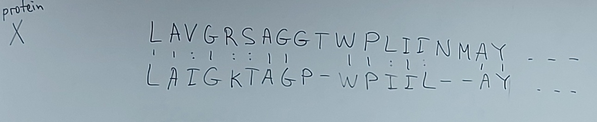
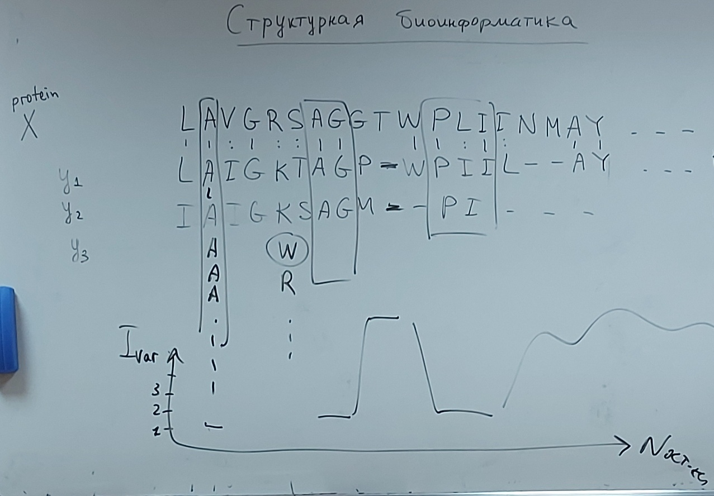
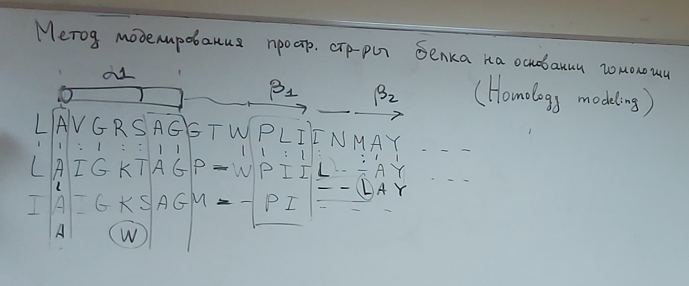
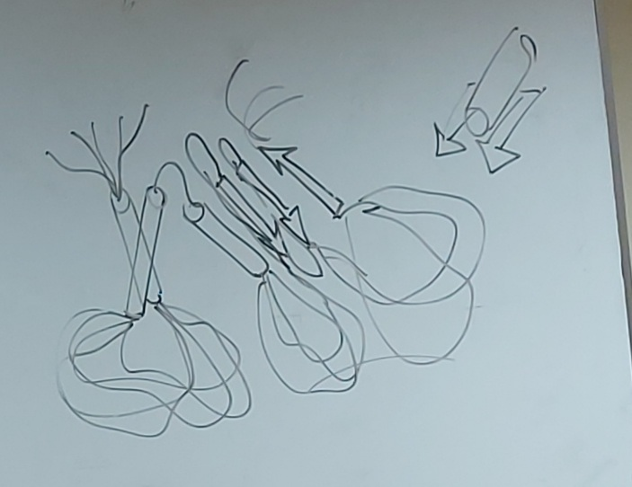
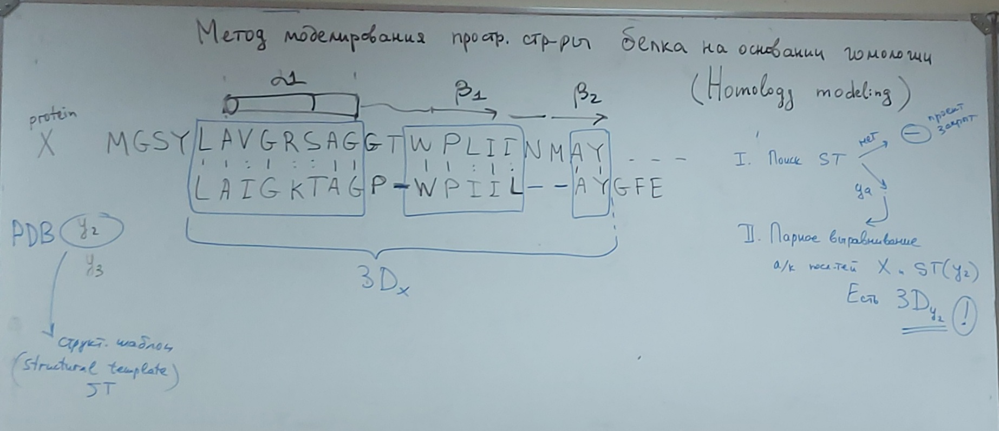
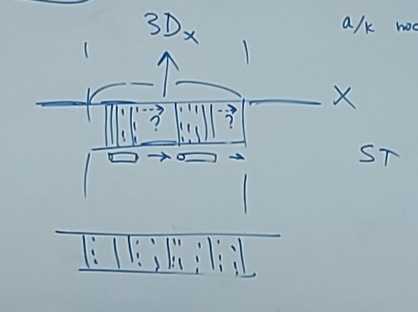
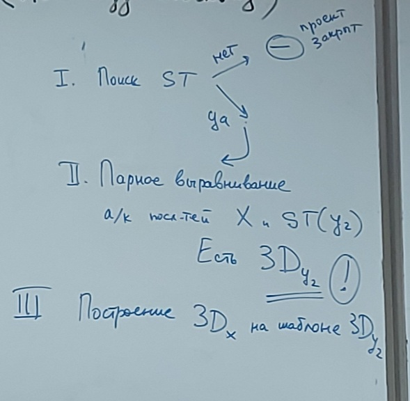
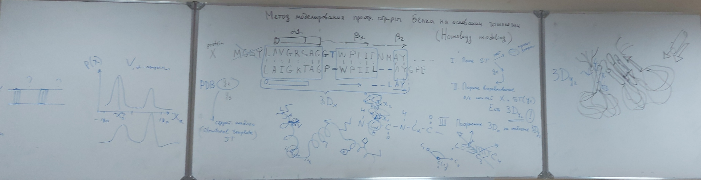

# Лекция 5 (04.10.2023)

## Структурная биоинформатика

Поиск гомолог. белков / Выравнивание а/к последовательностей

Профиль вариабельности

Паттерн последовательности аминокислотных остатоков - это некоторое ее подмножество с определнными свойствами

(В данном контексте паттерн и мотив это одно и тоже)

## Метод моделирования простр. стр-ры белка на основании гомологии (Homology modeling)

1. Поиск структурного шаблона

2. Построение выравнивания $x/y_2$
   

   

3. Построение $3D_x$ по модели $3D_{y_2}$

4. Какова $3D_x$?
