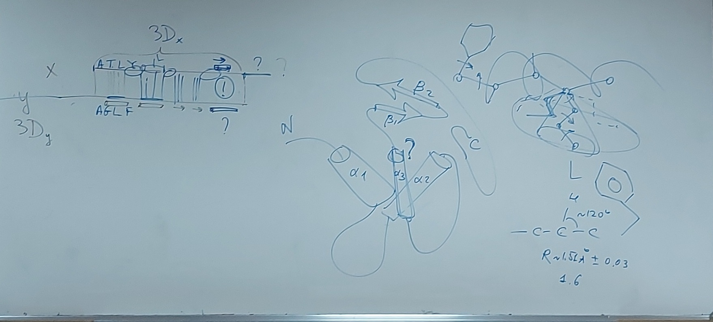
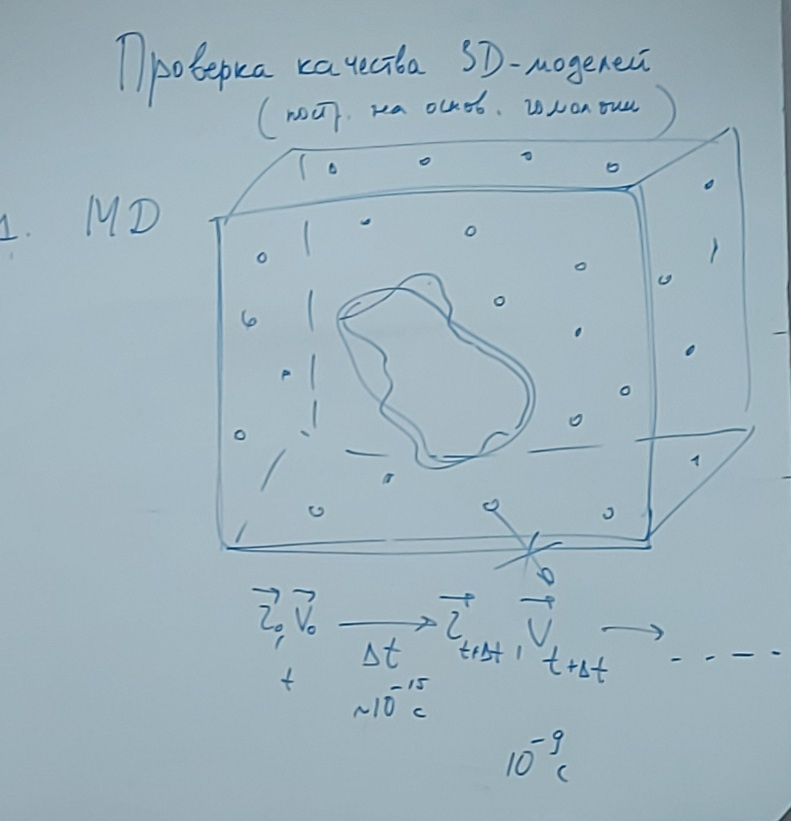
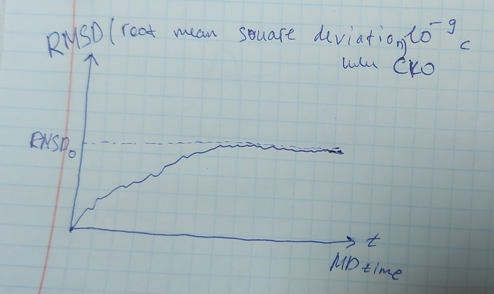
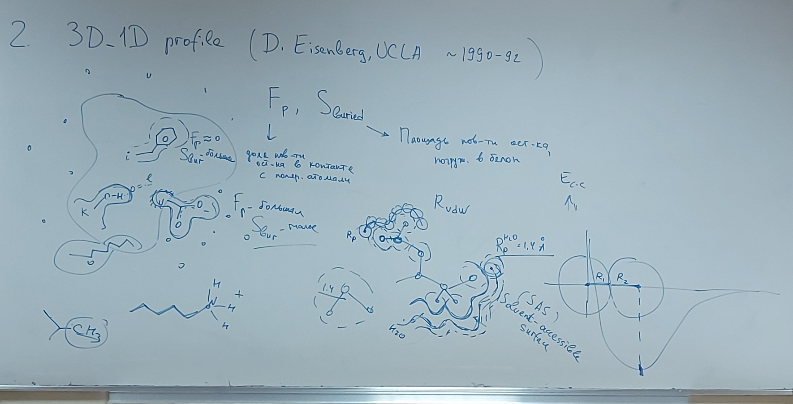
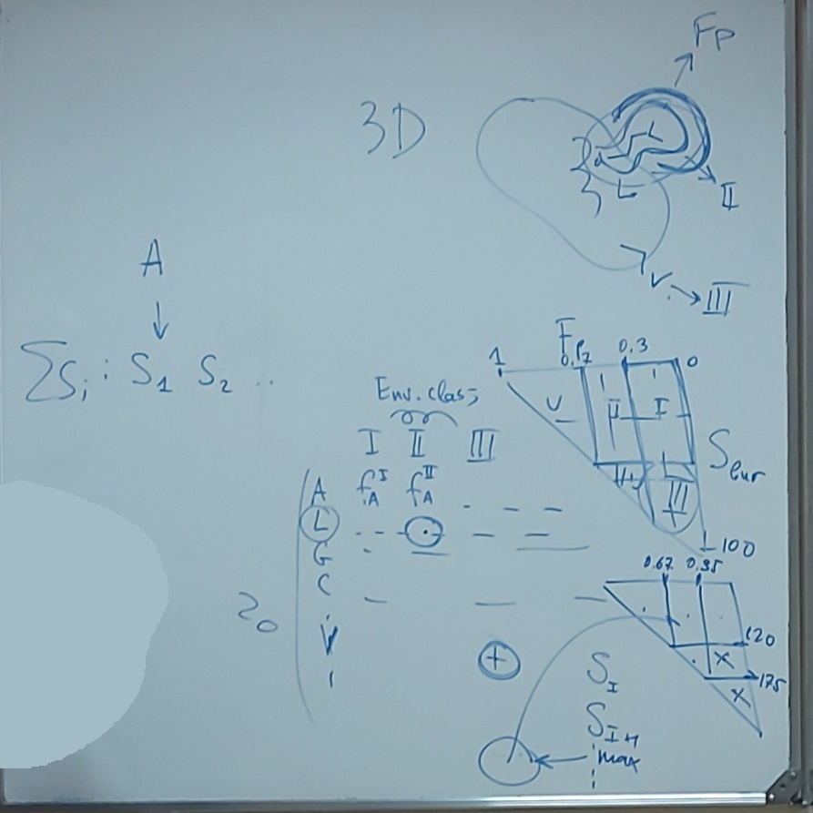
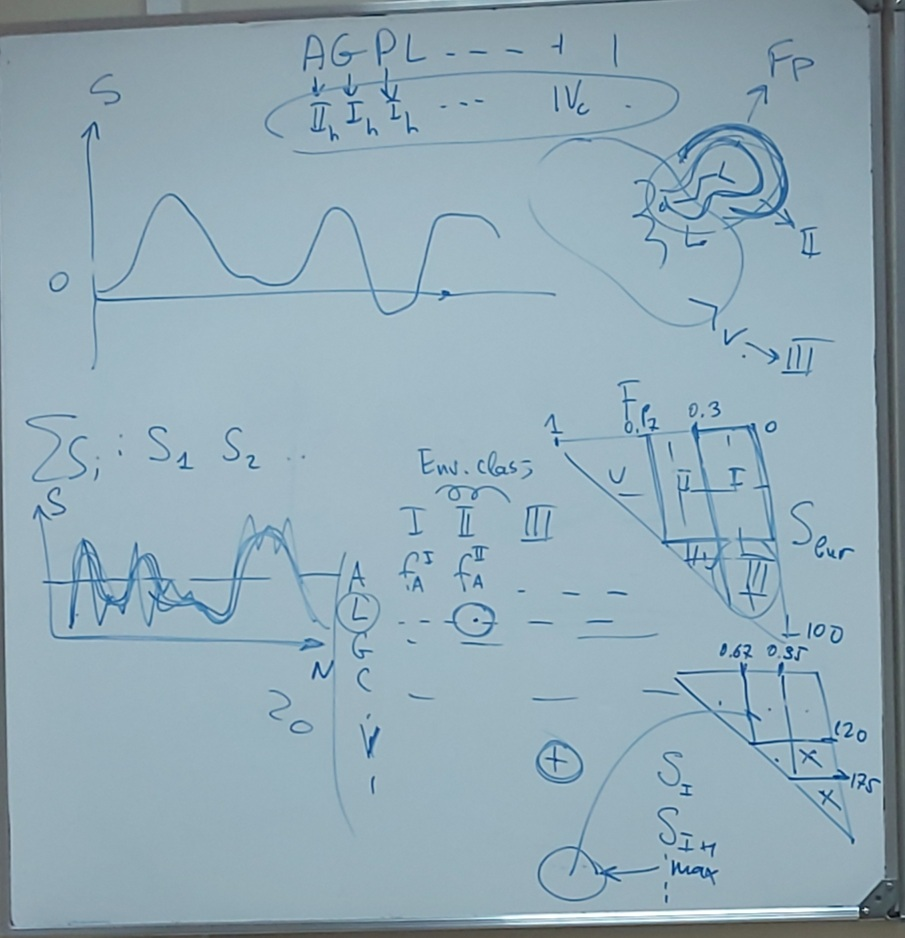

# Лекция 6 (11.10.2023)

Проблема фолдинга белка - как белкам в природе получается найти свое нативное состояние? (С оптимальной энергией)

Методы определения (физические, эксперементальные) пространственной структуры (то откуда они берутся в Базе Данных):

* Кристаллизация
* Рентген?
* ...

Ратомерные библиотеки - данные основанные на собранной информации о том как строятся белки.

## Проверка качества 3D модели построенных на основании гомологии

Просто проверить расстояния и углы (геометрию структуры) недостаточно, потому что мы делаем замены и в нашей модели есть участки где на самом деле может быть другая структура.

Общего решения нет, но есть 2 подхода:

1. MD (Метод молекулярной динамики)
   Молекулярная динамика модели в среде. Помещаем белок в воду. Задаем начальную скорость. Решаем уравнения Ньютона (движения) для каждой частицы в системе. 
   

   Записываем координаты каждые dT сек. Задача - посмотреть будет ли модель ввести себя устойчиво/стабильно (оцениваем среднеквадратичное отклонение, нужно чтобы оно было минимальным). Но для начала нужно сделать это со структурным шаблоном.
   

   Может получится что белок будет разваливаться (СКО будет постоянно расти). Это может быть из неправильного моделирования (например, воды). Также СКО может расти если белок состоит из разных жестких частей, которые сами могут свободно двигаться относительно друг друга.

2. Метод 3D_1D profile (предложен группой D. Eisenberg, UCLA ~1990)

   Сначало считаем доли поверхности доступные ($F_p$) растворителю (воде) и недоступные ($S_{buried}$)
   

   Разбиваем остатки на классы для реперных белков (при каком положении границ, будет максимальная оценка) чтобы определить итоговую таблицу (На самом деле будет три таблицы для альфа-спирали, бета-структуры и всего остального):
   

   Затем считаем оценки для все остатков из нашей модели по этой таблице (классам). Если >0 (хорошее окружение) значит нормально построили, если <0 (плохое окружение) значит что-то не так (например, модель плохая или потенциальное связывание):
   

   Метод очень мощные, позволяет делать полезные выводы.
