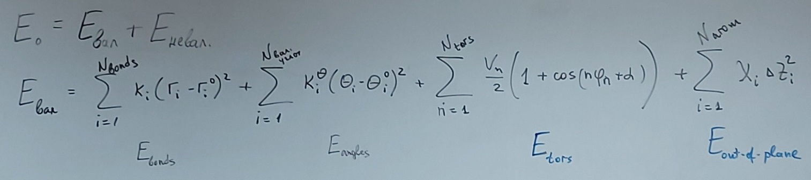
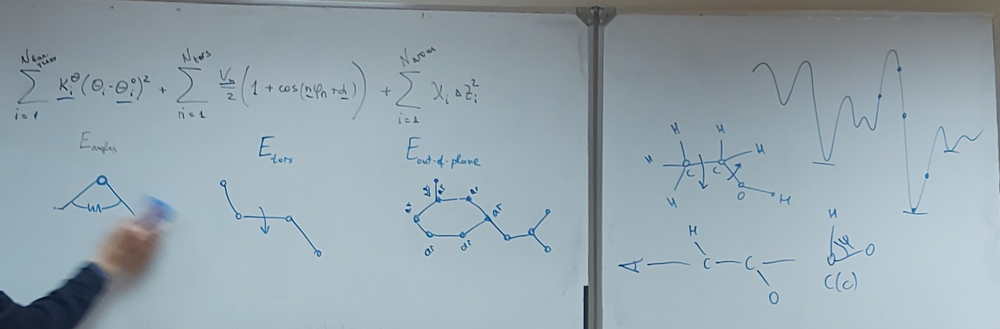
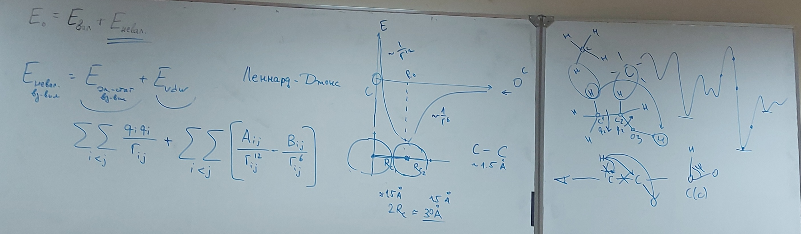
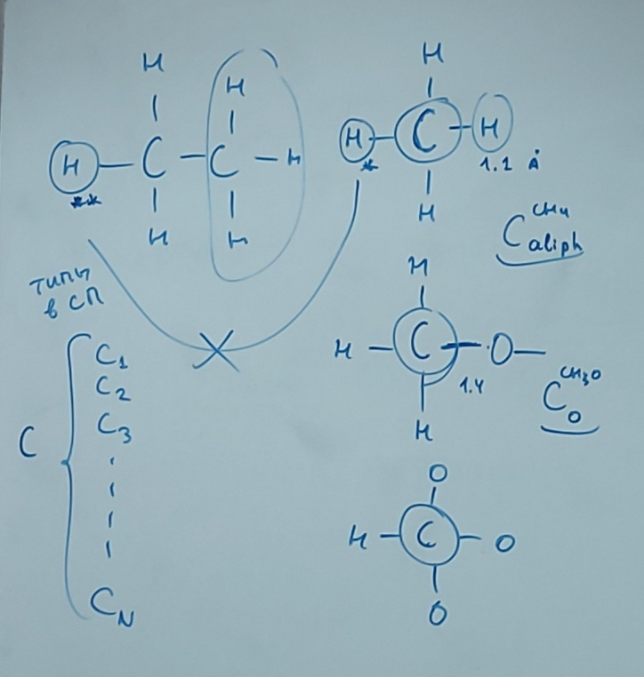
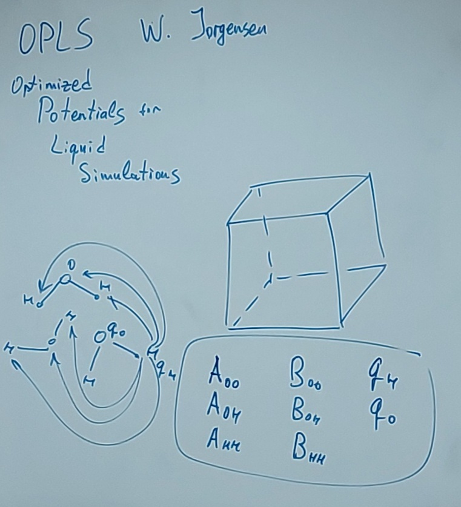
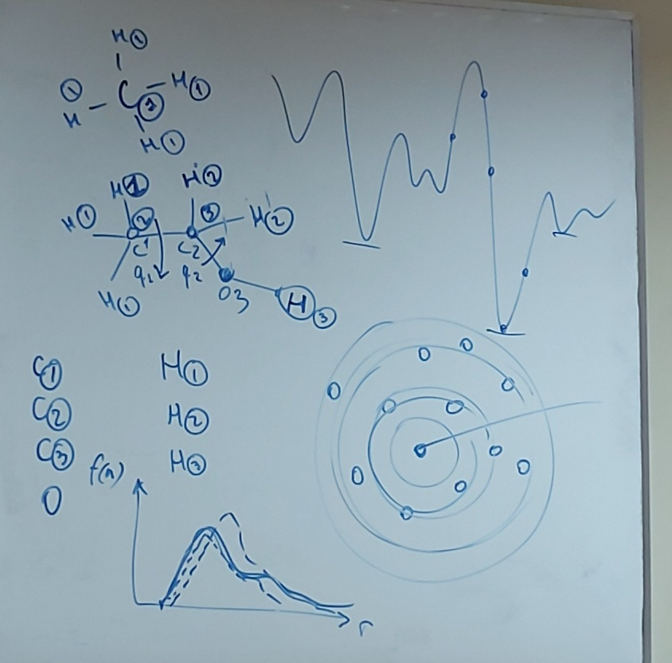
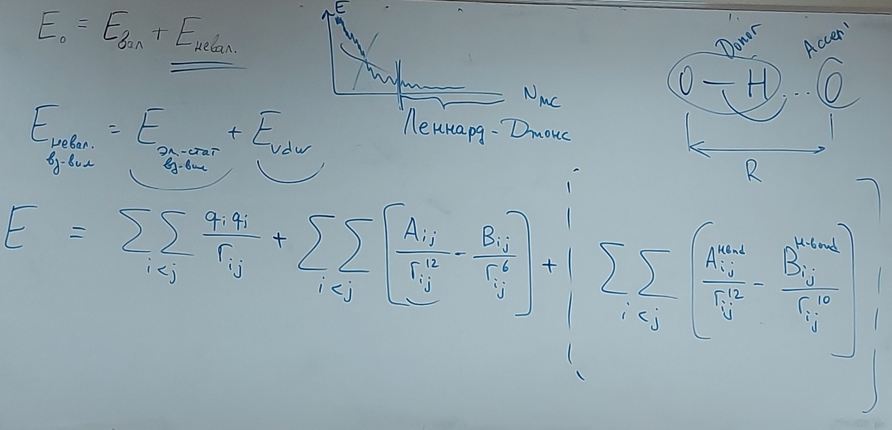
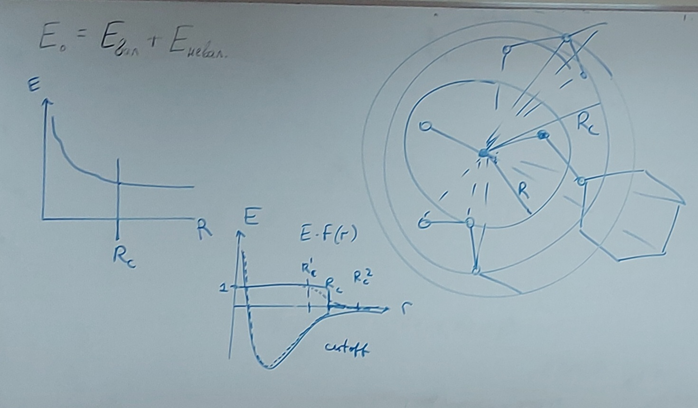

# Лекция 10 (15.11.2023)

## Энергия валентного взаимодействия

Вспоминаем материал с прошлой лекции:

## Энергия невалентного взаимодействия

Для атомов в разных молекулах (разные топологии) параметры силовых полей отличаются (например $A_{ij}, B_{ij}$):

## OPLS - **Optimized** **Potentials** **for** **Liquid** Simulations

Периодические условия на границах:

Радиальная функция распределения (и пример - сколько коэф-ов нужно посчитать при большем кол-ве различных атомов)

Еще вариант расчета $E_{невал}$ ($E_{H-bonds}$ вместо $E_{vdw}$):

## Приближение при расчете энергии

1) Метод отсечки (обрезание потенциала):
   
2) ...
