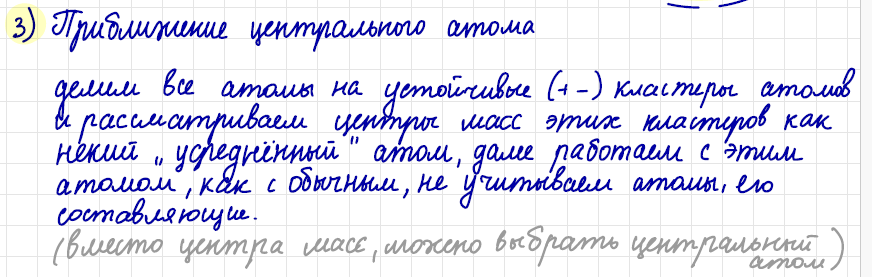
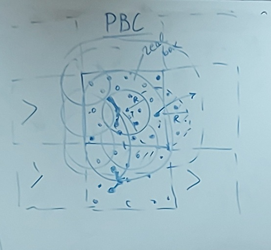
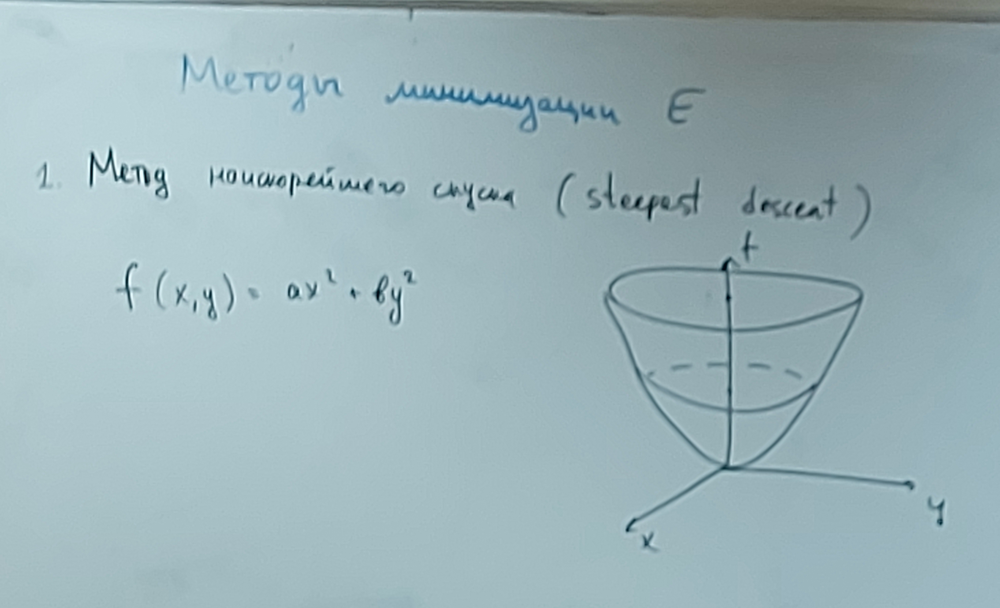
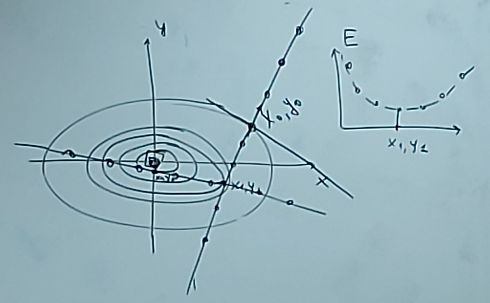
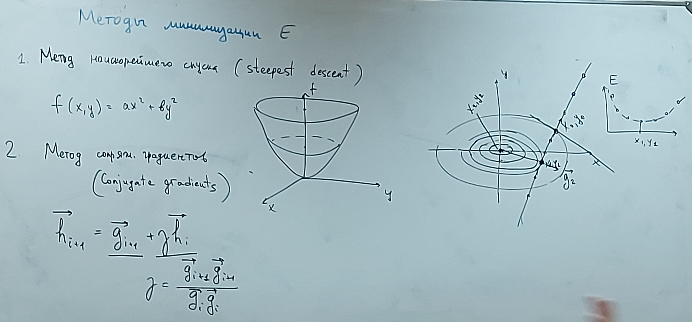
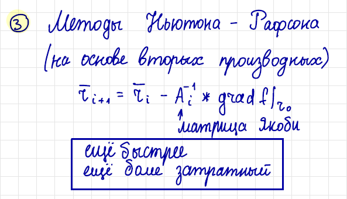
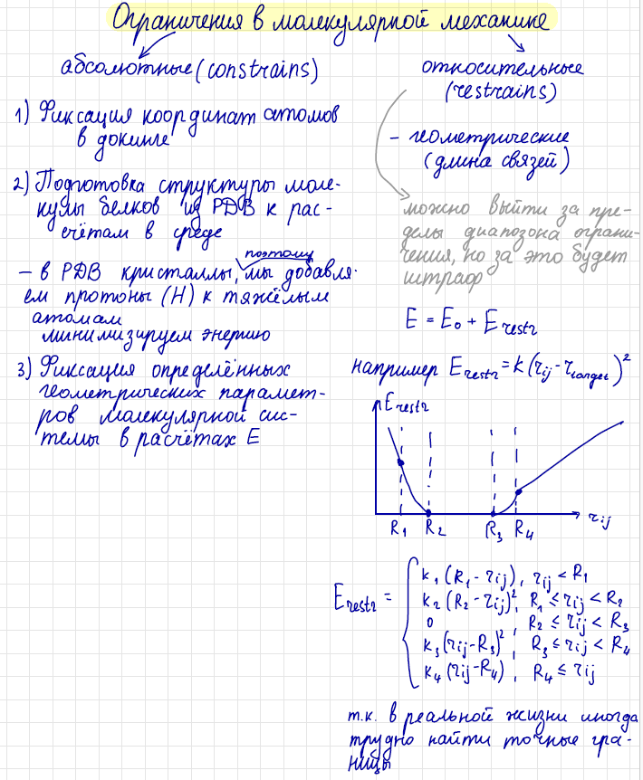

# Лекция 11 (29.11.2023)

Повторение

## Приближение при расчете энергии

1. Метод отсечки (обрезание потенциала):
   Считаем энергию между молекулами находящимися на некотором расстоянии и ближе

   

2. Метод двойной отсечки (потенциал обрезания с 2 границ.)
   То что находится ближе, сильнее влияет на энергию - считаем на каждом шаге. А то что дальше считаем реже (например каждый 10 шаг)

3. Приближение центрального атома
   

4. Приближение зарядовых групп
   Аналогично предыдущему, но для зарядов, в не для геометрии

5. Периодические граничные условия (Periodic Boundary Conditions, PBC)
   

## Метод минимизации молекулярной энергии

1. Метод наискорейшего спуска (steepest descent) (почти градиентный спуск)
   

   

2. Метод сопряженных градиентов
   

3. Методы Ньютона - Рафсона
   

## Ограничения в молекулярной механике

* Абсолютные
* Относительные

