# Лекция 12 (06.12.2023)

## Метод молекулярной динамики

$\Large m_i \vec{a}_i=\vec{F}_i=-\frac{\partial V}{\partial \vec{r}}$ - уравнение Ньютона

Задача МД - зная координаты и скорости в начальный момент времени, рассчитать координаты и скорости в любой момент времени

$\Large \begin{aligned} & \Delta t \\ & \vec{r}(t) \rightarrow \vec{r}(t+\Delta t) \\ & \vec{v}(t) \rightarrow \vec{v}(t+\Delta t)\end{aligned}$

$\Large r(t+\Delta t)=r(t)+\frac{d r}{d t} \Delta t+\frac{1}{2} \frac{d^2 r}{d t^2} \Delta t^2+\ldots \theta\left(\Delta t^3\right)$

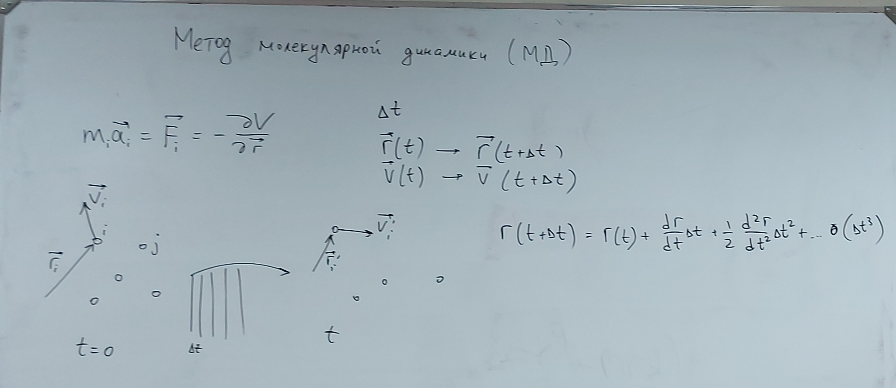

### Алгоритм Верле

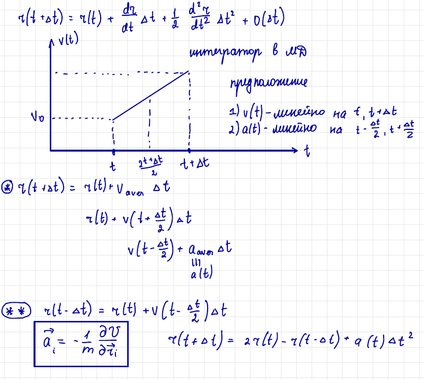
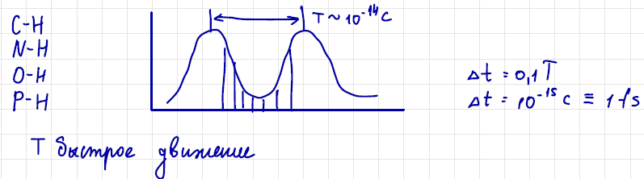

$\Large r(t+\Delta t)=r(t)+V_{\text {ave }} \cdot \Delta t=T(t)+V\left(t+\frac{\Delta t}{2}\right) \Delta t$

$\Large V\left(t+\frac{\Delta t}{2}\right)=V\left(t-\frac{\Delta t}{2}\right)+a \Delta t$

$\Large a=\frac{F}{m}=-\frac{1}{m} \frac{\partial v}{\partial r}$

$\Large +\left(\begin{array}{l}r(t+\Delta t)=r(t)+\frac{d r}{d t} \Delta t+\frac{1}{2} \frac{d^2 r}{d t^2} \Delta t^2 \\ r(t-\Delta t)=r(t)-\frac{d^2}{d t} \Delta t+\frac{1}{2} \frac{d^2 r}{d t^2} \Delta t^2\end{array}\right.$

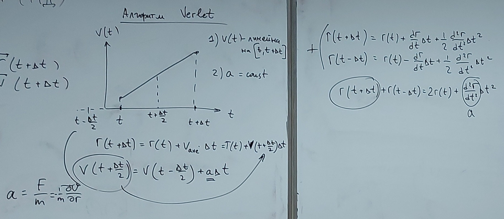

.jpeg)

Какой $\Delta t$ взять? (Порядка $10^{-15}$ с [фента секунд] - тогда корректно учтем самые быстрые изменения, колебания)

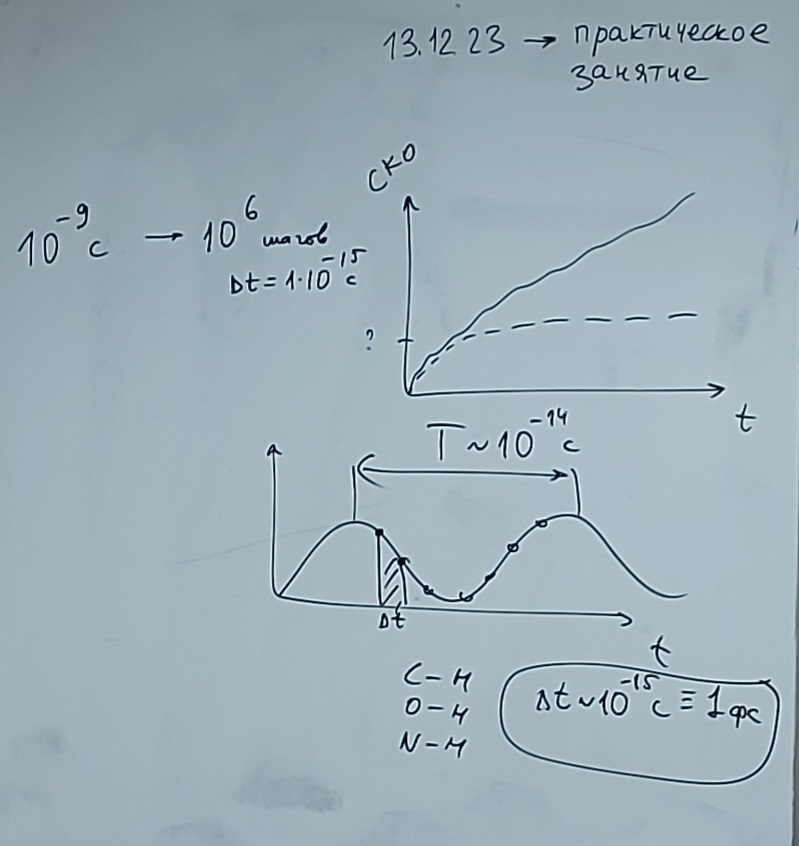

Откуда взять начальные скорости? Распределение Максвелла:

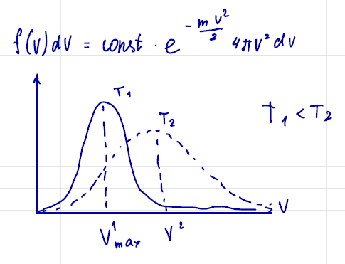

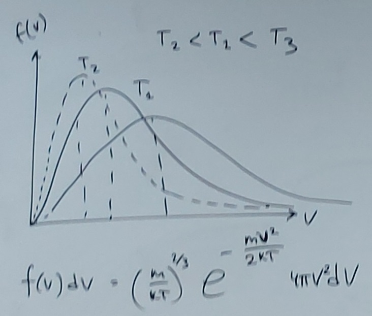

Отслеживаем с какого момента система выходит на равновесие:

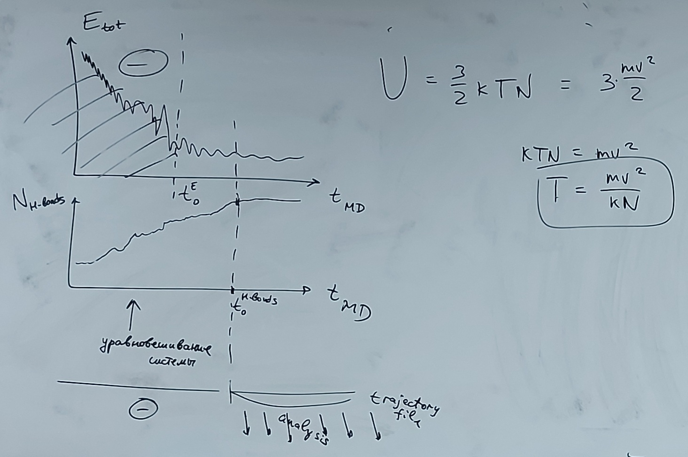

### Алгоритм МД

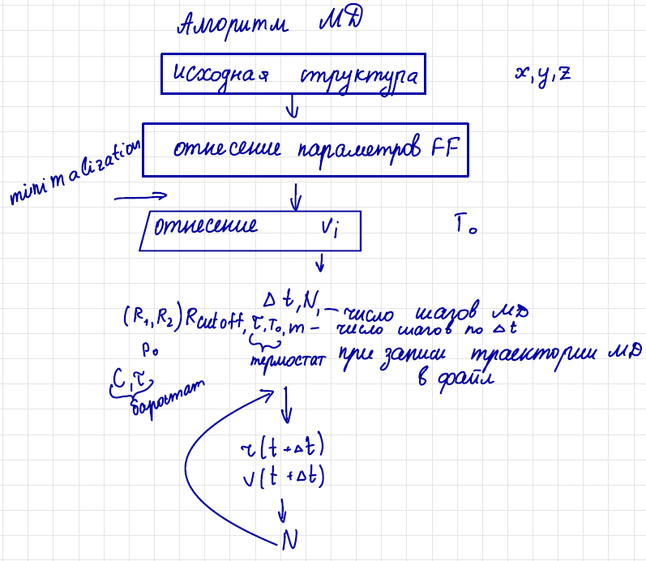

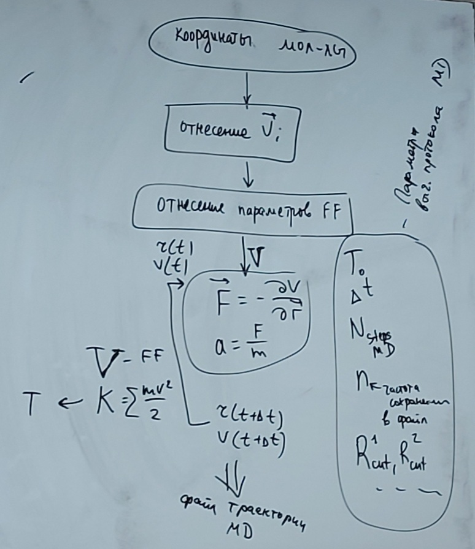

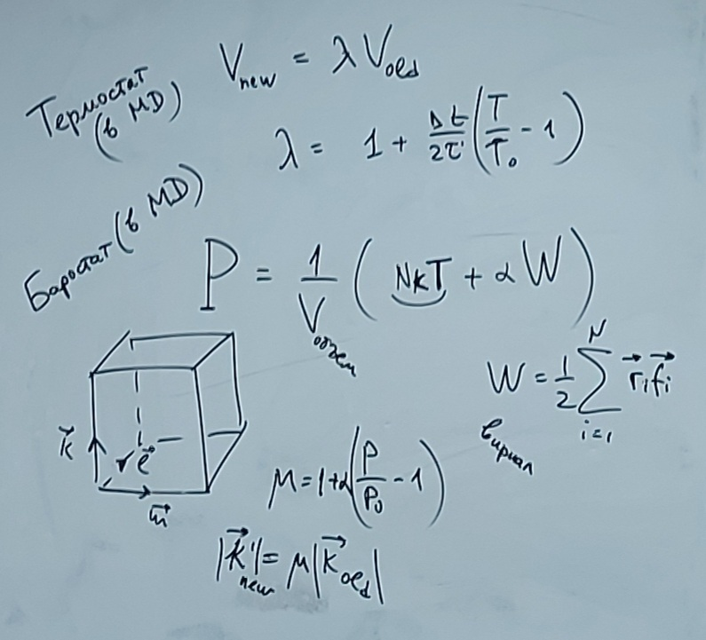

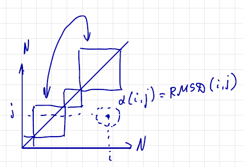
