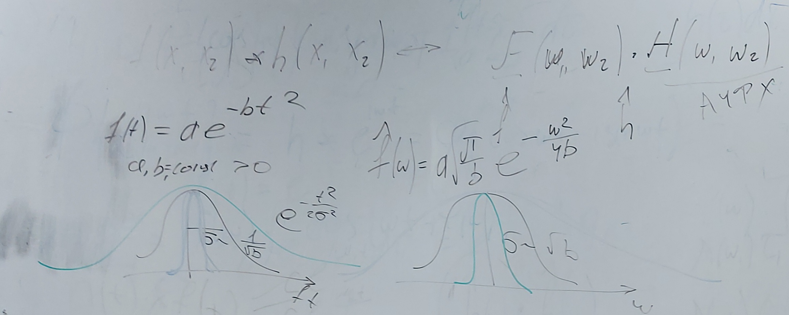

# Лекция 3 (07.10.2023) - Свёртка как линейный фильтр

$\Large \frac{d}{dt}e^{pt}=pe^{pt}$ (p - комплексное число)

$Av=\lambda v$ (v - собственная функция, $\lambda$ - собственное число, $A$ - оператор)
Экспонента - это собственная функция оператора дифференцирования. 

$\Large f(t)=\sum{c_ie^{pt}}$

$\Large (e^{i\omega t})'=i\omega e^{i\omega t}$

$\Large f(t)=\int{f(t)e^{-i \omega t} dt}=\hat{f}(\omega)$

## Свертка

Свертка	 $\Large \int_{-\infty}^{+\infty}{f(\tau)h(t-\tau)d\tau}=f*h(t) \sim \hat{f}(\omega)*\hat{h}(\omega)$

​			$\Large \int_{-\infty}^{+\infty}{f(t-\tau)h(\tau)d\tau}$

$\Large h(\tau)$ - импульсная характеристика

$\Large \Phi(\alpha f_1 + \beta f_2)=\alpha \Phi(f_1) + \beta \Phi(f_2)$

$\Large (f*h)(t-\tau)=(f*h)(t)$??????????

## Математические определения

$\Large \Phi(f(t))=\int_{-\infty}^{+\infty}{h(t)f(t-\tau)dt}=h*f$

Импульсная характеристика

$\Large h(t)=\int_{-\infty}^{+\infty}{h(t)\sigma(t-\tau)d\sigma}$

### Переходная функция

...

$\Large H(t)=\Phi\{X(t)\}=\int_{-\infty}^{+\infty}{h(\tau)}1_{[0 \infty]}(t-\tau)d\tau,$ где $\Large (1_{[0 \infty]} - \text{Функция Хевисайда})$

### Передаточная функция:

$\Large h*e^{}=\int_{-\infty}^{+\infty}{h(\tau)e^{p(t-\tau)}d\tau}=e^{pt}\int_{-\infty}^{+\infty}{h(\tau)e^{-p\tau}d\tau},$ где $\Large \int_{-\infty}^{+\infty}{h(\tau)e^{-p\tau}d\tau}=W(p)=L\{h(t)\}$ - Передаточная функция

Ограничение импульсной хар-ки:

$h(t)=
\begin{equation*}
	\begin{cases}
		h(t), t\ge0 \\
		0, t < 0
	\end{cases}
\end{equation*}$

### Имп. хар-ка каузальных систем:

$\Large \int_{\infty}^{\infty}{h(t-\tau)f(\tau)d\tau}$

### Амплитудно частотная фазовая хар-ка

$\Large e^{i\omega t} = cos(\omega t)+i sin(\omega t) | e^{pt}=e^{xt}*e^{i\omega t}, (p=x+i\omega)$ 

$\Large h*e^{i\omega t}=\int_{\infty}^{\infty}{h(\tau)e^{i\omega(t-\tau)}d\tau}=e^{i\omega t}\int_{\infty}^{\infty}{h(\tau)e^{-i\omega \tau}d\tau}$

$\Large W(i\omega)=|W(i\omega)|e^{Arg(W(i\omega))}$

...

$\Large \Phi\{e^{i\omega t}\}=h*e^{i\omega t}=\Phi(cos(\omega t)+i sin(\omega t))=\lambda(\omega)[ cos(\omega t + f(\omega))+sin(\omega t + f(\omega))]$

### Гаусовская функция

Гаусовскую функцию можно записать так:

$\Large f(t)=ae^{-bt^2}, a_1 b_1=cos_{...}>0$

$\Large \hat{f}(\omega)=a\sqrt{\frac{\pi}{b}}e^{-\frac{\omega^2}{4b}}$

АЧФЧ - амплитудно частотная фазовая характеристика

$\Large \hat{f}(\omega) \hat{h}(\omega)= \hat{y}(\omega)$

$\Large F^{-1}\{\hat{y}(\omega)\}=y(t)$

$\Large \hat{y}(\omega)=W(i\omega)$

$\Large F^{-1}\{\hat{h}(\omega)\}=h(t)$

$\Large f(t)*h(t)=y(t)$

### Принцип неопределенности Гейзенберга

$\Large \sigma_t^2 \sigma_{\omega}^2=\frac{1}{4}$

$\Large \sigma_t^2 \sigma_{\omega}^2 \ge \frac{1}{4}$

### Дискретная свертка

$\Large f(x)*h(x)=\sum_{n=-\infty}^{\infty}{f(m)h(x-m)}$

$\Large \sum{f(t_i)*h(t_j-t_i)}$

$\Large \frac{1}{3}f(t_{j+1})+\frac{1}{3}f(t_j)+\frac{1}{3}f(t_{j-1})=f(t_j)$

Свертка с прямоугольным окном

Окно это функция спадающая по краям

Гладкие окна лучше чем прямоугольные, т.к. там нету высоких частот

## Семинар

$\Large \sum_{j=1}^{12}{x_j*W_j}=y_j$